<!-- ═══════════════════ ANIMATED HEADER ═══════════════════ -->

 

<!-- ═══════════════════ ABOUT + CONTRIBUTION ═══════════════════ -->

<table>
<tr>
<th align="center">🔵 ❯ about.me</th>
<th align="center">🟢 ❯ contribution.snake</th>
</tr>
<tr>
<td width="50%" align="center" valign="top">

 

  

**Yashpreet Singh** 🧑‍💻

 

  

  

🧠 `overthinking` · 💾 `somehow full` · ☕ `critical`
🐛 `multiplying` · 😴 `not found` · ⌨️ `compiling...`

 

**`> status: probably fine. ™`**

 

  

</td>
<td width="50%" align="center" valign="top">

 

<picture>
  <source media="(prefers-color-scheme: dark)" srcset="https://raw.githubusercontent.com/yashpreeto7/yashpreeto7/output/github-snake-dark.svg" />
  <source media="(prefers-color-scheme: light)" srcset="https://raw.githubusercontent.com/yashpreeto7/yashpreeto7/output/github-snake.svg" />
  
</picture>

  

🏆 `survived another year of touching grass`

 

🟡 ● ● ● ● ● ● 👻 👻 👻 👻

**`> mission: eat bugs, ship features, repeat`**

  

</td>
</tr>
</table>

 

<!-- ═══════════════════ TECH STACK ═══════════════════ -->

<table>
<tr>
<th align="center">⚡ ❯ weapons.of.choice</th>
</tr>
<tr>
<td align="center">

 

**Languages & Frameworks** &nbsp;&nbsp;|&nbsp;&nbsp; **Tools & Infra** &nbsp;&nbsp;|&nbsp;&nbsp; **Cloud**

 

 

 

  

</td>
</tr>
</table>

 

<!-- ═══════════════════ STATS + STREAK ═══════════════════ -->

<table>
<tr>
<th align="center">📊 ❯ github.stats</th>
<th align="center">🔥 ❯ streak.stats</th>
</tr>
<tr>
<td width="50%" align="center" valign="top">

 

<picture>
  <source media="(prefers-color-scheme: dark)" srcset="./profile/stats-dark.svg" />
  
</picture>

 

</td>
<td width="50%" align="center" valign="top">

 

<picture>
  <source media="(prefers-color-scheme: dark)" srcset="https://streak-stats.demolab.com/?user=yashpreeto7&theme=dark&hide_border=true&background=00000000" />
  
</picture>

 

 

</td>
</tr>
</table>

 

<!-- ═══════════════════ BUILDING + ACHIEVEMENTS ═══════════════════ -->

<table>
<tr>
<th align="center">🔮 ❯ now.building</th>
<th align="center">🏆 ❯ achievements</th>
</tr>
<tr>
<td width="50%" valign="top">

 

🧪 **AI tools** that actually help

🎨 **Better** developer experiences

⚙️ **Backend** systems that scale

🔮 **Whatever** I get obsessed with next

 

| Item | Status |
|:---|:---:|
| ⌨️ Mechanical Keyboard | ✅ |
| 💻 VS Code (47 extensions) | ✅ |
| 🔧 Git (force push certified) | ✅ |
| 💡 17 Unfinished Side Projects | ✅ |
| ☕ Coffee (IV drip edition) | ✅ |
| 😴 Sleep | ❌ |

 

</td>
<td width="50%" valign="top">

 

> 🏅 **It Works™** — Ran the code without error (once) `+10 XP`

> 🗑️ **Deleted node_modules** — The universal solution `+25 XP`

> 📖 **Read The Docs** — Impossible achievement `+50 XP`

> 🧙 **Stack Overflow Wizard** — Copied the accepted answer `+100 XP`

 

**Total XP:** `9999+` &nbsp; `████████████████████████`

 

**`$ who are you?`**
`> just a dev who ships in caffeine`

**`$ can you fix this bug?`** `> magic ✨`

 

</td>
</tr>
</table>

 

<!-- ═══════════════════ SECRET ═══════════════════ -->

<b>🔒 secret.exe</b> — click to unlock

 

<table>
<tr>
<th align="center">👾 ❯ secret.exe</th>
</tr>
<tr>
<td align="center">

 

🔓 **You found the secret area!**

🏛️ `Achievement Unlocked: README Archaeologist`

 

👾 &nbsp; 🛸 &nbsp; 🌟 &nbsp; 👽 &nbsp; ⭐ &nbsp; 🪐 &nbsp; 🌌 &nbsp; 🔭

 

**fun facts** · I mass-produce side projects at 2 AM · My git log is longer than my sleep log · `console.log("debugging")` is my IDE · `Error: Maximum recursion depth exceeded`

 

☕ `coffee: overflow` · 🛌 `sleep: null` · 💡 `3AM ideas: infinite` · 📁 `browser tabs: 347+` · 🔥 `"last commit": lies`

 

**`> come back later, more secrets loading...`** 🕹️

 

</td>
</tr>
</table>

 

<!-- ═══════════════════ CONNECT ═══════════════════ -->

<table>
<tr>
<th align="center">🤝 ❯ connect</th>
</tr>
<tr>
<td align="center">

 

**`> Let's build something cool together.`**

 

&nbsp;
&nbsp;
&nbsp;

  

</td>
</tr>
</table>

 

<!-- ═══════════════════ FOOTER ═══════════════════ -->

